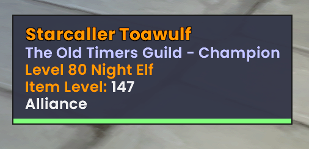
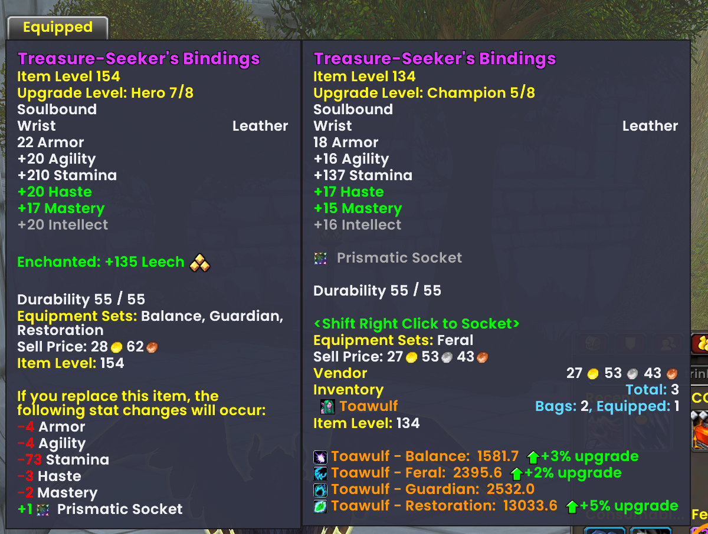
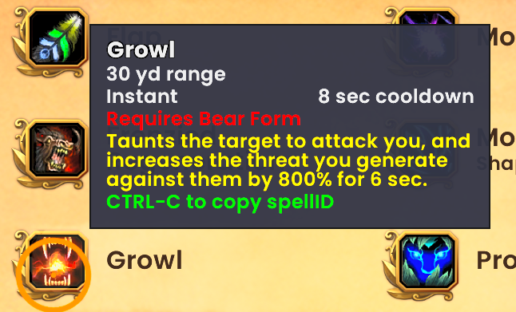
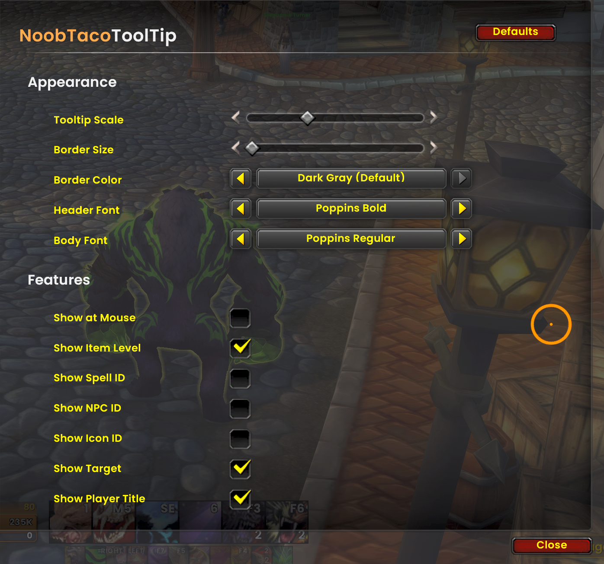

# NoobTacoToolTip

   

A clean, and informative tooltip replacement for World of Warcraft.

## What is this?
**NoobTacoToolTip** (NTTT) takes your standard default tooltips and gives them a makeover. It makes them look sharper, provides more useful information at a glance, and lets you customize how they look.

## Key Features
*   **Looks Better**: Crisp borders, custom backgrounds, and customizable fonts.
*   **Information Rich**:
    *   **Item Levels**: See item levels directly on the tooltip.
    *   **IDs**: Spell ID, NPC ID, and Icon ID displays.
    *   **Unit Info**: Class colors for names, race/level info, and who the unit is targeting.
*   **Customizable**:
    *   Adjust the scale.
    *   Pick your border colors.
    *   Choose separate fonts for headers and body text.
    *   Anchor the tooltip to your mouse or the default position.

## How to Use
1.  Install the addon.
2.  Log into World of Warcraft.
3.  Go to `Options` -> `AddOns` -> `NoobTacoToolTip`.
4.  Tweak the settings to your heart's content!

## Previews

### Tooltip Examples

### Options Menu

## Feedback & Support
Found a bug? Have a suggestion? Feel free to open an issue on the [GitHub repository](https://github.com/NoobTaco/NoobTacoToolTip).

## License
Code in this repository is licensed under GPL-3.0-or-later. See `LICENSE` for details.
*Media files (fonts, audio, textures) are included under their respective upstream licenses.*

## 📄 AI Usage

See [AI_USAGE.md](https://github.com/NoobTaco/NoobTacoToolTip/blob/main/AI_USAGE.md) for more information.
